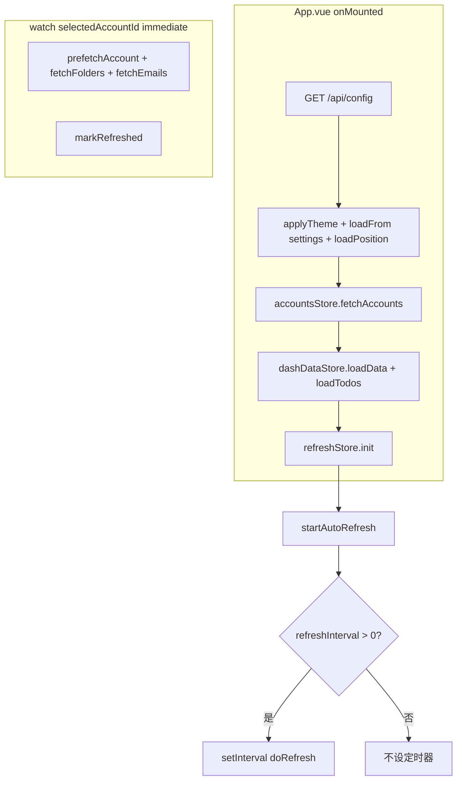
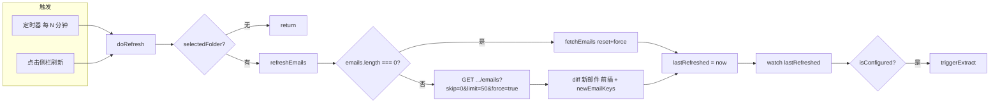
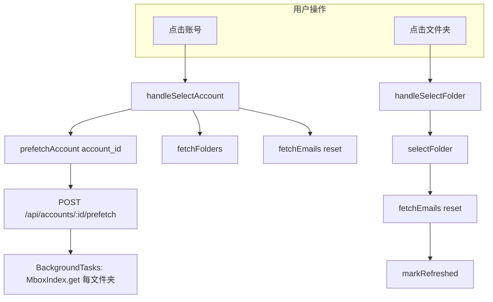
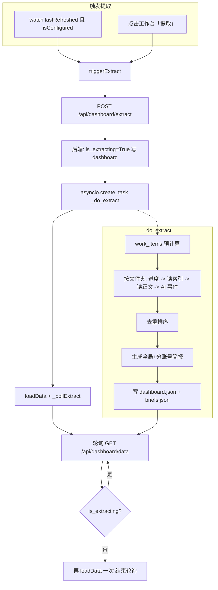
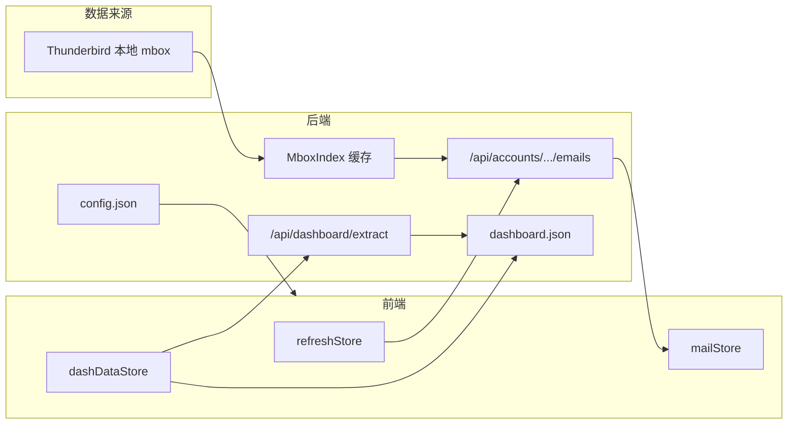

# EmailReader 流程与自动化说明

本文档按「自动化更新邮件」「预热/索引」「自动化提取」以及各类手动操作，逐项说明触发时机、范围、执行任务、产出和涉及函数/参数，并附 Mermaid 流程图。

---

## 一、概念前提

- **邮件数据来源**：本应用**不**主动从 IMAP 拉信，只读取 **Thunderbird 已同步到本地的 mbox 文件**。因此没有“应用内自动接收邮件”的流程；收信由 Thunderbird 自身完成。
- **后端数据目录**：`backend/data/`，内含 `dashboard.json`、`todos.json`、`briefs.json`、`config.json` 等。
- **前端**：Vue 3 + Pinia，PyWebView 或浏览器访问同一后端。

---

## 二、自动化更新邮件（列表刷新）

### 2.1 触发时间点

| 触发方式 | 时间点 |
|----------|--------|
| **定时自动刷新** | 每隔 **N 分钟** 一次（N = 设置里的「自动刷新间隔」） |
| **手动点击侧栏刷新按钮** | 用户点击时 |

**参数来源**：`settings.refreshInterval`（分钟），0 = 关闭自动刷新。存于后端 `config.json` 的 `settings.refreshInterval`，前端从 `/api/config` 加载。

### 2.2 触发后涉及范围

- **仅当前选中的文件夹**：`mailStore.selectedFolder`（当前账号 + 当前文件夹）。
- 不跨账号、不跨文件夹；不触发 Dashboard 提取。

### 2.3 具体执行任务

1. **定时器**（仅当 `refreshInterval > 0`）  
   - `refreshStore.init()` 在 App 挂载时调用 → `startAutoRefresh()` → `setInterval(doRefresh, mins * 60 * 1000)`。  
   - 每到间隔则调用 `doRefresh(true)`（参数 true 未在实现里使用，可忽略）。

2. **一次刷新的实际动作**  
   - `refreshStore.doRefresh()`  
     - 若 `!mailStore.selectedFolder` 或 `isRefreshing` 则直接 return。  
     - 否则 `await mailStore.refreshEmails()`，然后 `lastRefreshed = new Date()`。

3. **mailStore.refreshEmails()**  
   - 若当前邮件列表为空：退化为 `fetchEmails({ reset: true, force: true })`，即拉当前文件夹第一页并重置列表。  
   - 若列表非空：  
     - 请求 `GET /api/accounts/{account_id}/folders/{folder_id}/emails?skip=0&limit=50&force=true`（不 reset 列表）。  
     - 用返回的 `data.emails` 与当前 `emails` 做 diff，**仅将新出现的邮件前插**到列表，并更新 `totalEmails`、`folderUnread`。  
     - 若有新邮件，设置 `newEmailKeys`，约 2.5 秒后清空（用于前端“新邮件”动画）。

### 2.4 产出

- 前端：当前文件夹邮件列表更新（新邮件在顶部），未读数徽章更新。  
- 后端：无持久化；`force=true` 会令该 mbox 的 `MboxIndex` 缓存失效，下次请求时重建索引（见下文「预热/索引」）。

### 2.5 涉及函数与参数（汇总）

| 层级 | 函数/API | 参数/说明 |
|------|----------|-----------|
| 前端 | `refreshStore.init()` | 无参；App.vue onMounted 调用 |
| 前端 | `refreshStore.startAutoRefresh()` | 无参；内部读 `settings.refreshInterval`，≤0 则不设定时器 |
| 前端 | `refreshStore.doRefresh()` | 无参；内部调 `mailStore.refreshEmails()` |
| 前端 | `mailStore.refreshEmails()` | 无参；依赖 `selectedFolder` |
| 后端 | `GET /api/accounts/{account_id}/folders/{folder_id:path}/emails` | `skip=0`, `limit=50`, `force=true` |
| 后端 | `MboxIndex.invalidate(mbox_path)` | `force=True` 时调用，清缓存 |
| 后端 | `read_emails(mbox_path, skip, limit)` | 线程池执行，返回 `{ success, emails, total, unread_total }` |

---

## 三、预热/索引（prefetch）与“接收”的边界

### 3.1 说明

- **没有“应用内自动接收邮件”**：收信由 Thunderbird 同步到本地 mbox；本应用只读磁盘。  
- **prefetch**：在用户切换账号或首次选账号时，**后台预热该账号下所有 mbox 的索引**，减少后续打开文件夹时的首屏延迟。

### 3.2 触发时间点

| 触发方式 | 时间点 |
|----------|--------|
| **点击侧栏某个账号** | `handleSelectAccount(acc)` |
| **应用启动后默认选中账号** | `watch(accountsStore.selectedAccountId, …, { immediate: true })` |

### 3.3 涉及范围

- **单个账号**：当前选中的 `account_id`。  
- 对该账号下 **所有有 .msf 的 mbox 文件夹** 并行建索引（`list_folders` 得到列表，再对每个 `path` 调 `MboxIndex.get(path)`）。

### 3.4 具体任务与产出

- **前端**：`mailStore.prefetchAccount(account_id)` → `POST /api/accounts/{account_id}/prefetch`。  
- **后端**：`prefetch_account(account_id, background_tasks)`  
  - 取该账号 `mail_dir`，`list_folders(mail_dir)` 得到所有文件夹；  
  - `background_tasks.add_task(_warm_all)`，其中 `_warm_all` 对每个 `size_bytes > 0` 的文件夹执行 `_run(MboxIndex.get, f["path"])`。  
- **产出**：内存中该账号各 mbox 的 `MboxIndex` 缓存就绪；不写 JSON，不触发提取。

### 3.5 涉及函数与参数

| 层级 | 函数/API | 参数/说明 |
|------|----------|-----------|
| 前端 | `mailStore.prefetchAccount(accountId)` | 账号 ID |
| 后端 | `POST /api/accounts/{account_id}/prefetch` | 路径参数 `account_id` |
| 后端 | `list_folders(mail_dir)` | 扫描目录，返回 `[{ folder_id, name, path, size_bytes }]` |
| 后端 | `MboxIndex.get(path)` | 建索引并缓存；首次 mmap 扫描头部，按日期排序 |

---

## 四、自动化提取（Dashboard 事件 + 简报）

### 4.1 触发时间点

| 触发方式 | 时间点 |
|----------|--------|
| **自动** | **每次「邮件列表」完成一次刷新后**（`lastRefreshed` 从无到有或变化），且 **AI 已配置**（`settingsStore.isConfigured`） |
| **手动** | 用户在工作台点击「提取」按钮 |

- 自动触发逻辑：`App.vue` 中 `watch(() => refreshStore.lastRefreshed, (val, old) => { if (val && old && settingsStore.isConfigured) dashDataStore.triggerExtract() })`。  
  - 要求 `val && old` 表示至少发生过一次刷新（避免首屏无刷新就提一次）。

### 4.2 涉及范围（按后端配置）

- **账号**：Thunderbird 能读到的**所有账号**（`read_thunderbird_accounts()`）。  
- **文件夹**：每个账号下 **最多 N 个文件夹**（N = `max_folders_per_account`，默认 3），按 INBOX 优先再按名称排序取前 N 个。  
- **邮件**：每个文件夹内，**日期在最近 `ai_days` 天内**的邮件，最多 `max_emails_per_folder` 封（按日期倒序截断）。  
- **正文**：每封最多 `max_chars_per_email` 字符（用于发给 AI）。

### 4.3 具体执行任务（后端 _do_extract）

1. **写入状态**：`dashboard.json` 中 `is_extracting = True`，清空 `extract_error`。  
2. **预计算 work_items**：遍历所有账号与上述文件夹，得到 `(acc, folder, mail_dir)` 列表，`total_folders = len(work_items)`，用于进度条。  
3. **按文件夹循环**：  
   - 每文件夹开始时：写进度 `extract_progress = { current, total, message }` 到 `dashboard.json`。  
   - 用 `MboxIndex.get(mbox_path)` 取索引，按日期过滤出 `filtered`，再读正文（`_read_msg_body`），得到 `emails_for_ai`。  
   - 调用 AI（prompts 中 `extract` 的 system + user_template），解析返回的 JSON 为事件列表，并做 `_patch_event_datetime_from_mail`。  
   - 事件合并到 `all_events`、`acc_events`；元数据合并到 `all_meta`、`acc_meta`。  
4. **去重与排序**：按 `(title, datetime)` 去重，再按时间排序。  
5. **生成简报**：全局简报 + 各账号简报（`_gen_brief`），调用 AI 生成文本。  
6. **写回**：将 `events`、`topics`、`people`、`brief`、`account_briefs`、`account_stats`、`acc_events`、`stats`、`extracted_at`、`is_extracting=False`、`extract_progress=null` 等写入 `dashboard.json`；并将今日简报追加到 `briefs.json`。

### 4.4 产出

- **dashboard.json**：事件列表、话题、联系人、全局/分账号简报、统计、`extracted_at`。  
- **briefs.json**：新增一条今日简报（含 `brief`、`account_briefs`、`stats`）。  
- 前端：通过轮询 `GET /api/dashboard/data` 得到进度与最终数据，工作台展示事件、简报、进度条。

### 4.5 涉及函数与参数（汇总）

| 层级 | 函数/API | 参数/说明 |
|------|----------|-----------|
| 前端 | `dashDataStore.triggerExtract()` | 无参；内部用 `settings` 拼 body |
| 前端 | `fetch('POST', '/api/dashboard/extract', body)` | body 见下 |
| 前端 | `loadData()` | 无参；`GET /api/dashboard/data?t=...`，写入 store |
| 前端 | `_pollExtract()` | 轮询；前 5 次 1.5s，之后 5s |
| 后端 | `POST /api/dashboard/extract` | `ExtractRequest` |
| 后端 | `trigger_extract(req)` | 写 `is_extracting=True`，`asyncio.create_task(_do_extract(req))` |
| 后端 | `_do_extract(req)` | 见上节 |

**ExtractRequest 字段**（前端传的与默认）：

- `base_url`, `api_key`, `model`：来自设置  
- `ai_days`：来自设置（默认 7）  
- `max_emails_per_folder`：前端固定 500  
- `max_chars_per_email`：前端固定 1200；后端默认 1500  
- `max_folders_per_account`：后端默认 3  

---

## 五、手动操作与对应流程

### 5.1 侧栏「刷新」按钮

- **操作**：点击侧栏刷新图标。  
- **调用**：`refreshStore.doRefresh(true)`。  
- **效果**：同「二、自动化更新邮件」一次刷新；若之后 `lastRefreshed` 变化且已配置 AI，会再触发一次提取。

### 5.2 切换账号

- **操作**：点击侧栏某账号。  
- **调用**：`handleSelectAccount(acc)` → `accountsStore.selectAccount(acc.account_id)`，`mailStore.prefetchAccount(acc.account_id)`，`mailStore.fetchFolders(acc.account_id)`，`mailStore.fetchEmails({ reset: true })`。  
- **效果**：prefetch 该账号所有文件夹索引；拉取该账号文件夹列表并选中 INBOX（或第一个）；重置邮件列表并拉第一页。

### 5.3 切换文件夹

- **操作**：点击侧栏某文件夹。  
- **调用**：`handleSelectFolder(folder)` → `mailStore.selectFolder(..., folder)`，`mailStore.fetchEmails({ reset: true })`，`refreshStore.markRefreshed()`。  
- **效果**：当前文件夹变更；邮件列表重置并拉第一页；仅更新“上次刷新时间”，不发起新的 refresh 请求。

### 5.4 工作台「提取」按钮

- **操作**：点击工作台「提取」。  
- **调用**：`dashDataStore.triggerExtract()`（若已配置 AI）。  
- **效果**：同「四、自动化提取」；不依赖 `lastRefreshed`。

### 5.5 设置保存

- **操作**：在设置弹窗中点击「保存设置」。  
- **调用**：`settingsStore.save()` → `PUT /api/config`，body `{ settings: { ... } }`。  
- **效果**：后端合并并写入 `config.json`；`refreshInterval` 变更后由前端的 watch 重新 `startAutoRefresh()`。

### 5.6 邮件列表内「重新加载」

- **操作**：邮件列表区域内的刷新/重载（若有）。  
- **调用**：`mailStore.refreshEmails()` + `refreshStore.markRefreshed()`（见 EmailList.vue `reload()`）。  
- **效果**：同一次增量刷新，并更新 `lastRefreshed`（可能再次触发自动提取）。

---

## 六、流程图（Mermaid）

### 6.1 应用启动与初始化

### 6.2 自动化更新邮件（定时 + 手动刷新）

### 6.3 切换账号/文件夹 与 prefetch

### 6.4 自动化提取 端到端

### 6.5 数据流总览（简化）

---

## 七、关键文件索引

| 功能 | 前端 | 后端 |
|------|------|------|
| 刷新/定时 | `stores/refresh.js` | - |
| 邮件列表/刷新 | `stores/mail.js` | `main.py` get_emails, read_emails |
| prefetch | `stores/mail.js` prefetchAccount | `main.py` prefetch_account, mail_reader.MboxIndex |
| 提取 | `stores/dashboardData.js` triggerExtract, loadData, _pollExtract | `main.py` trigger_extract, _do_extract |
| 配置 | `stores/settings.js`, App.vue | `main.py` get_config, put_config, config.json |
| 侧栏行为 | `components/SideBar.vue` | - |
| 自动提取触发 | App.vue watch lastRefreshed | - |

以上为当前项目的自动化与主要手动流程说明；若某处实现有细微变动，以代码为准，本文档可作为索引快速对照。
